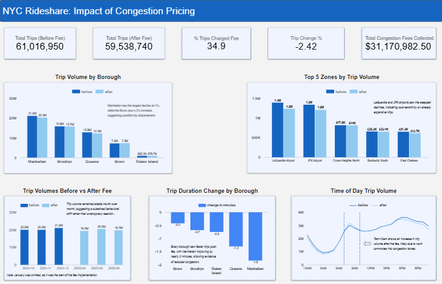

# NYC Rideshare: Quasi-Experimental Analysis of Congestion Pricing Impact

This analysis aims to understand the initial impact of New York City's newly implemented "congestion fee" within the city's ridesharing landscape, with a focus on the Central Business District and its surrounding boroughs. By doing this, ridesharing companies such as Uber and Lyft can take these trends to better position drivers, adjust pricing strategy, and most importantly, retain the existing customer base. 

# Project Background
On January 5, 2025, the city of New York officially kick-started a $1.50 "congestion fee" to be applied to ridesharing trips, specifically in Manhattan south of and including 60th street. Traveling by car in such a densely populated area can be a pain for both drivers and riders. Drivers are required to enter a zone that is one of the most congested urban corridors in the country, while riders now have to pay an extra fee on top of other fees and standard rates, potentially causing frustration on both sides. All of this matters because the city thrives on ridesharing, drivers need to feel rewarded for providing a critical service, and customers need to feel like the service isn't just trying to take money from them. 

# Data Source
The data is from the NYC Taxi and Limousine Commission, where each month has records of all ridesharing trips, whether that be from ridesharing companies or taxi service. The months covered in this analysis are October-December 2024, and February-April 2025, with January 2025 purposely omitted since it was the start of the fee. Dataset contained 6 individual files, totaling just over 120 million records. This dataset was chosen as it is from an official source, the scale and depth of the data enables meaningful statistical analysis. 

## Raw Data Dictionary

**High Volume FHV Trip Records (2024)**
| Column | Type | Description |
|--------|------|-------------|
| hvfhs_license_num | STRING | TLC license number of the HVFHS base |
| dispatching_base_num | STRING | TLC base number of the dispatching base |
| originating_base_num | STRING | TLC base number of the originating base |
| request_datetime | TIMESTAMP | Date and time of trip request |
| on_scene_datetime | TIMESTAMP | Date and time driver arrived |
| pickup_datetime | TIMESTAMP | Date and time of pickup |
| dropoff_datetime | TIMESTAMP | Date and time of dropoff |
| PULocationID | INT | Pickup taxi zone ID |
| DOLocationID | INT | Dropoff taxi zone ID |
| trip_miles | FLOAT | Trip distance in miles |
| trip_time | INT | Trip duration in seconds |
| base_passenger_fare | FLOAT | Base fare before fees |
| tolls | FLOAT | Toll charges |
| bcf | FLOAT | Black car fund fee |
| sales_tax | FLOAT | Sales tax |
| congestion_surcharge | FLOAT | NYS congestion surcharge |
| airport_fee | FLOAT | Airport surcharge |
| tips | FLOAT | Tip amount |
| driver_pay | FLOAT | Total driver pay |
| shared_request_flag | STRING | Rider requested shared ride |
| shared_match_flag | STRING | Rider matched for shared ride |
| access_a_ride_flag | STRING | MTA Access-a-Ride trip |
| wav_request_flag | STRING | Wheelchair accessible vehicle requested |
| wav_match_flag | STRING | Wheelchair accessible vehicle matched |

**High Volume FHV Trip Records (2025 additions)**
| Column | Type | Description |
|--------|------|-------------|
| cbd_congestion_fee | FLOAT | Congestion pricing fee for CBD trips |

**taxi_zones**
| Column | Type | Description |
|--------|------|-------------|
| LocationID | INT | Unique zone identifier |
| borough | STRING | NYC borough name |
| zone | STRING | Neighborhood zone name |

# Methodology

This analysis follows a quasi-experimental design, using NYC's congestion pricing 
implementation as a natural cutoff to measure behavioral change in rideshare patterns. 
Rather than a traditional A/B test, this approach leverages a real-world policy event 
to compare behavior before and after a known intervention.

The before period (Oct-Dec 2024) and after period (Feb-Apr 2025) were deliberately 
chosen to be symmetric (three months on each side) to avoid one period statistically 
dominating the other. January 2025 was omitted as the implementation month, where 
rider and driver behavior was expected to be erratic and inconsistent.

Raw Parquet files were sourced directly from the NYC TLC website and loaded into 
Google Cloud Storage, then ingested into Google BigQuery for analysis. Data cleaning 
removed invalid records including zero distance trips, negative fares, and unrealistic 
outliers, esulting in only 0.13% of records being removed, **preserving 99.87%** of 
the original dataset.

Analysis was conducted in BigQuery using SQL, with visualizations built in Python 
via Google Colab and a summary dashboard built in Looker Studio. All tools were 
chosen to reflect a real-world product analytics workflow within the Google Cloud 
ecosystem.

## Key Findings

- **Manhattan saw the steepest decline** — trip volume dropped 4% in the three months 
  following fee implementation, nearly double the citywide rate of 2.4%.

- **The Bronx bucked the trend** — uniquely, the Bronx saw a 2% *increase* in trip 
  volume post-implementation, suggesting possible trip displacement from Manhattan to 
  outer borough destinations.

- **Congestion pricing made trips faster** — Manhattan's average trip duration decreased 
  by nearly 2 minutes after the fee, providing evidence that the policy achieved its 
  core goal of reducing traffic congestion.

- **Morning commuters were undeterred** — trips between 7AM and 10AM showed a notable 
  increase in volume after the fee, suggesting work commuters view the $1.50 charge as 
  an acceptable cost for a necessary trip.

- **Airport trips took the hardest hit** — LaGuardia (-11.2%) and JFK (-9.9%) saw the 
  greatest zone-level declines, indicating cost sensitivity among riders already paying 
  premium fares.

- **No dramatic month-over-month swings** — trip volume remained consistent across the 
  analysis period, suggesting a sustained behavioral shift rather than a temporary 
  reaction to the fee.
  

# Next Steps: Part 2

This analysis represents Part 1 of a broader investigation into NYC congestion 
pricing's impact on rideshare behavior — a stepping stone into a grander analysis. 
The quasi-experimental design was intentional: to test whether the implementation 
has started to show a measurable trend in the immediate aftermath of the policy.

Part 2 will expand to a full year-over-year comparison (2024 vs 2025), which will 
truly determine whether the congestion fee is producing lasting behavioral change 
or whether riders and drivers are simply adapting back to previous patterns. 

Specifically Part 2 will examine:

- Whether the initial behavioral shifts observed here persisted or normalized over time
- Seasonal patterns and how congestion pricing interacts with summer and holiday travel
- Long-term fare and tipping trends as riders fully adapt to the new pricing environment
- Whether outer borough impacts delayed effects not captured in this initial window
- Driver earnings and how congestion pricing affected the supply side of the market

*Data: NYC TLC High Volume FHV Trip Records, full year 2024 vs 2025*
